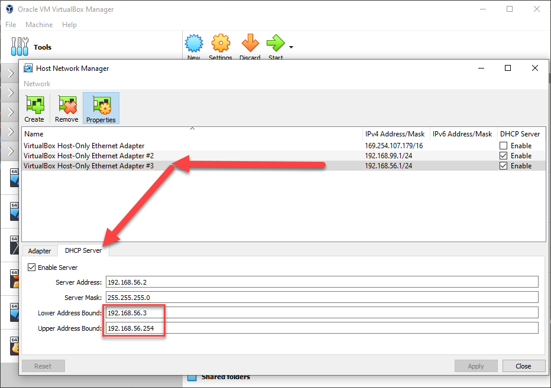

# Docker on Vagrant
Simplify local dev environment setup for containerized app to a `vagrant up` command.

## Host requirements
The environment works on Linux, Windows or Mac. The only requirements are a 
current version of [VirtualBox](https://www.virtualbox.org/wiki/Downloads) and 
[Vagrant](https://www.vagrantup.com/downloads) installed.

## Usage
Clone the repo to an empty directory on your filesystem and rename the 
`Vagrantfile.example` to `Vagrantfile`.

(Optional)Open `Vagrantfile` in your favorite editor and change the value of `ENV_IP` to 
any IP address within the range of the private IP interface created by 
VirtualBox. 

> This allows having multiple environments running at the same time without 
> polluting the `localhost` or using custom ports like `8080` to access the apps 
> running on those environments. 
> 
> It also makes it easier to issue docker commands against the environment
> from your host machine. As well as configuring the docker host running
> inside the environment with any code editor or IDE with docker support.

> By default VirtualBox creates a network interface with the private IP 
> range from `192.168.56.3` to `192.168.56.254`
>
> To figure out the private IP for your VirtualBox installation open VirtualBox
> and go to File > Host Network Manager.


To create the environment, open a terminal inside the `Vagrantfile`'s directory and do:
```bash
vagrant up
```
Allow the script to complete, ssh into the environment with:
```bash
vagrant ssh
```
And start containerRING.

> Refer to [Vagrant documentation](https://www.vagrantup.com/docs/cli) for more details on the above commands.

## Optional Setup for the Docker host
The environment exposes the docker daemon on port `2375` with the `ENV_IP` set 
in the `Vagrantfile`.

To issue execute docker commands from local docker cli, set the `DOCKER_HOST`
variable to the environment's Docker daemon address at `ENV_IP:2375`:
```bash
# Linux or Mac
export DOCKER_HOST=tcp://<ENV_IP>:2375

# Windows
set DOCKER_HOST=tcp://<ENV_IP>:2375
```

It's also possible to manage containerized apps within the environment without 
the terminal - using a code editor like [vscode](https://code.visualstudio.com/remote/advancedcontainers/develop-remote-host):


Or poke around with an IDE like [PhpStorm](https://www.jetbrains.com/help/phpstorm/docker.html)

